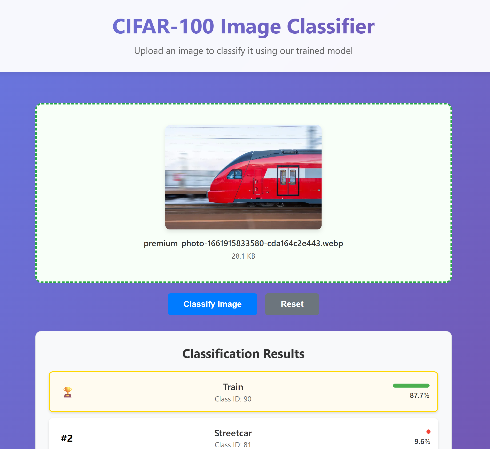

# CIFAR 100 Classification

This was a project of mine that was built using PyTorch to classify the images from the CIFAR-100 dataset. I attempted to build my own model without using any pretrained model from online, in an effort to improve my machine learning skills and understanding. The final model achieves close to 70% test accuracy.

The model is deployed using a full stack web application being powered by FastAPI on the backend for serving the model and a React + TypeScript frontend. Drag and drop any image of your choice onto the frontend and see what the model predicted for you!



## Run Backend:

Navigate to the `/backend` folder and run

```
uvicorn main:app --host 0.0.0.0 --port 8000 --reload
```

## Run Frontend:

Navigate to the `/frontend` folder and run

```
npm start
```

Topics that I learned while doing this project:

1. Convolutional Neural Network (CNN) architecture
2. Image transforms from PyTorch
3. Max Pooling and BatchNorm2d
4. Tensor operations in the classifier
5. Optimizing dataloader operations in PyTorch
6. Calculating metrics like precision and recall using torchmetrics
7. Using torch compile to compile my model
8. How to use AdamW optimizer and setting its parameters
9. Cosine learning rate schedulers and how to optimize it
10. Using GradScalar for mixed precision training
11. Using early stopping when model reaches plateau in training
12. Validation using model.eval() every few epochs
13. Saving my model and making sure state dictionaries don't have missing keys
14. Fusing layers during evaluation
15. Pruning models
16. Optimizing CUDA
17. How to serve a model and do inference in FastAPI.
18. Using thread pool for backend serving
19. Learned how to use psutil library
20. Learned 5 new API security headers and why they are important.
21. Using Kaiming init for initializing neural networks
22. Test Time Augmentation for improving test time accuracy
23. Trying to minimize the memory of a model by garbage collection and reduced precision
24.
